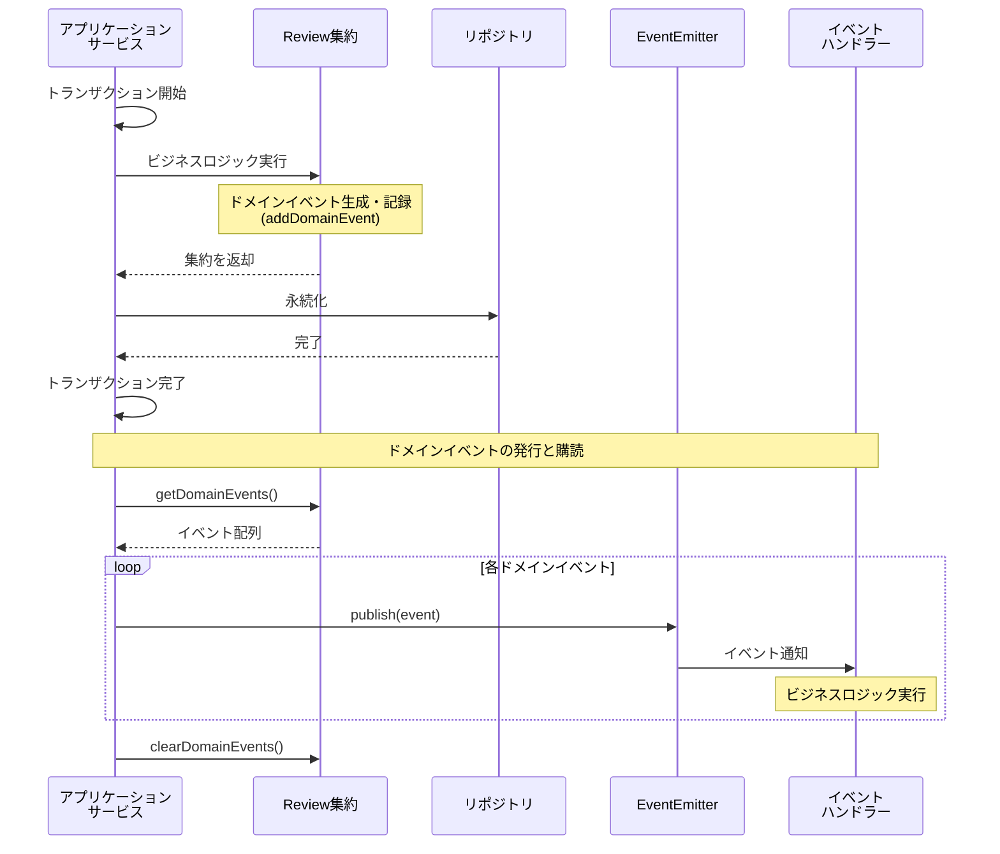

# 図 19-8-1 Pub/Sub の処理の流れ

```mermaid
sequenceDiagram
    participant AS as アプリケーション<br/>サービス
    participant RA as Review集約
    participant Repo as リポジトリ
    participant EE as EventEmitter
    participant EH as イベント<br/>ハンドラー

    AS->>AS: トランザクション開始
    AS->>RA: ビジネスロジック実行
    Note over RA: ドメインイベント生成・記録<br/>(addDomainEvent)
    RA-->>AS: 集約を返却
    AS->>Repo: 永続化
    Repo-->>AS: 完了
    AS->>AS: トランザクション完了

    Note over AS,EH: ドメインイベントの発行と購読

    AS->>RA: getDomainEvents()
    RA-->>AS: イベント配列

    loop 各ドメインイベント
        AS->>EE: publish(event)
        EE->>EH: イベント通知
        Note over EH: ビジネスロジック実行
    end

    AS->>RA: clearDomainEvents()
```
